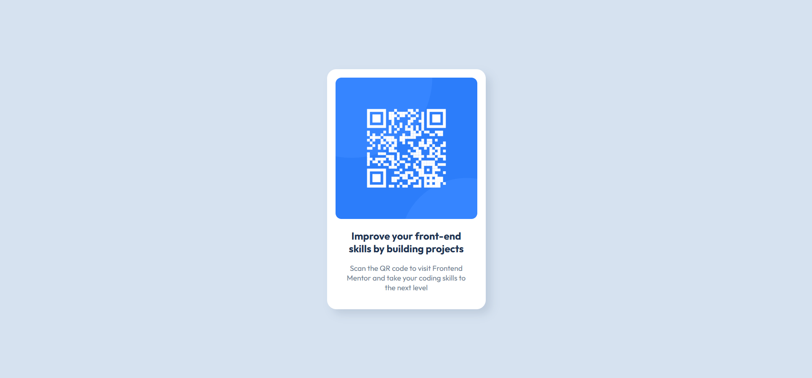

# Frontend Mentor - QR code component solution

This is a solution to the [QR code component challenge on Frontend Mentor](https://www.frontendmentor.io/challenges/qr-code-component-iux_sIO_H). Frontend Mentor challenges help you improve your coding skills by building realistic projects.

## Table of contents

- [Overview](#overview)
  - [Screenshot](#screenshot)
  - [Links](#links)
- [My process](#my-process)
  - [Built with](#built-with)
  - [What I learned](#what-i-learned)
- [Author](#author)

## Overview

### Screenshot



### Links

- Solution URL: [https://github.com/Gombeng/qr-code-component-main](https://github.com/Gombeng/qr-code-component-main)
- Live Site URL: [https://qr-code-component-main-six-rho.vercel.app/](https://qr-code-component-main-six-rho.vercel.app/)

## My process

### Built with

- Semantic HTML5 markup
- CSS custom properties
- Flexbox
- CSS Grid
- Mobile-first workflow
- [React](https://reactjs.org/) - JS library

### What I learned

you can use this to center an element

```css
.center-element {
  display: grid;
  place-items: center;
  min-height: 100dvh;
}
```

## Author

- Website - [Syahrizal Ardana](https://syahrizal-ardana.vercel.app/)
- Frontend Mentor - [@Gombeng](https://www.frontendmentor.io/profile/Gombeng)
